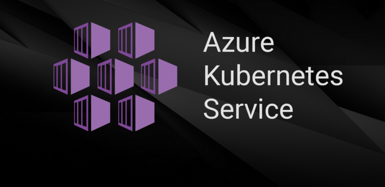
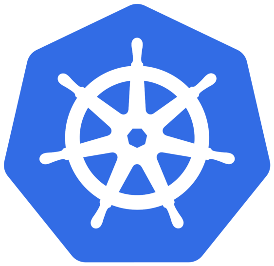
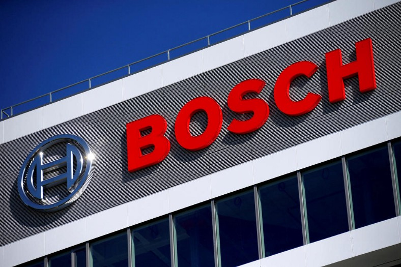
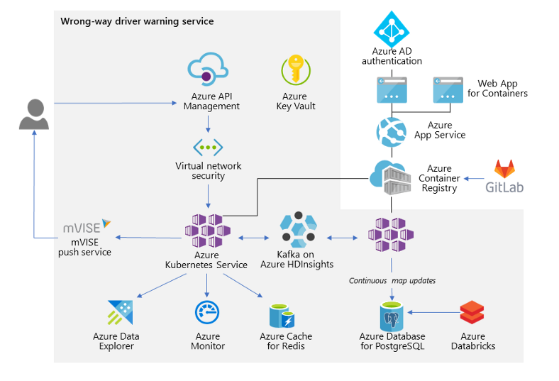

***
# ***Azure K8s Service (AKS) Case Study ~ Bosch***
#### ***Requirement, use and real world case study related to AKS***
***

Kubernetes is by far the most popular container orchestration tool we can also see from our previous article in which we have discussed the Requirement, use and real world case study related to kubernetes. here, but the complexities of managing the tool have led to the rise of fully-managed Kubernetes services over the past few years.

Taking these things under consideration the cloud companies have come up with their own managed service for the kubernetes. The great part about cloud-based managed Kubernetes services like Azure Kubernetes Service (AKS) from Azure cloud is that it integrates natively with other Azure services, and you don’t have to worry about managing the availability of your underlying clusters, auto scaling, or patching your underlying VMs.

***

## *Azure Kubernetes Service (AKS)*

Azure Kubernetes Service (AKS) is a fully-managed service that allows you to run Kubernetes in Azure without having to manage your own Kubernetes clusters. Azure manages all the complex parts of running Kubernetes, and you can focus on your containers. Basic features include:

✔ Pay only for the nodes (VMs)  
✔ Easier cluster upgrades  
✔ Integrated with various Azure and OSS tools and services  
✔ Kubernetes RBAC and Azure Active Directory Integration  
✔ Enforce rules defined in Azure Policy across multiple clusters  
✔ Kubernetes can scale your Nodes using cluster autoscaler  
✔ Expand your scale even greater by scheduling your containers on Azure Container Instances  

***

## *Technical Story of Bosch*

***Problem Statement:*** solve the problem of drivers going the wrong way on highways, the goal was to save lives. services like this already existed but precision and speed cannot be compromised.

***Expected Outcome:*** The result is the wrong-way driver warning (WDW) service and software development kit (SDK). Designed for use by app developers and original equipment manufacturers (OEMs)

***Solution Used:*** the architecture pivots on an innovative map-matching algorithm and the scalability of Microsoft Azure Kubernetes Service (AKS) in tandem with Azure HDInsight tools that integrate with the Apache Kafka streaming platform.

### *The right way to solve the wrong-way problem*

Smartphones or an onboard connectivity unit can anonymously record GPS coordinates and can send that location data to the cloud if the device is in a hotspot area, but GPS satellites broadcast their signals in space with only limited accuracy. What is received depends on many factors, including satellite geometry, signal blockage, atmospheric conditions, and the design and quality of the receiver. For example, GPS-enabled smartphones are typically accurate within a 4.9-meter (16-foot) radius under open sky.

The Bosch team had to solve two major issues: first, to get the last piece of information out of the noisy sensor data; and second, to develop a highly scalable and ultra-flexible service to process the data in near real time. The question was how to build a real-time data ingestion and processing pipeline capable of returning notifications to drivers within seconds.

The problem was speed. The team assumed that devices emitting location information, such as smartphone apps and automotive head units, could eventually send thousands of data points to the solution per second, from all over Europe and eventually other countries.

The team decided to offload the work of scaling and cluster maintenance to a managed service in a public cloud with a global reach. A team of Microsoft cloud solution architects worked closely with Bosch engineers, who provided valuable feedback to Azure product teams.

The key was orchestration. By orchestrating the deployment of containers using AKS, Bosch would get repeatable, manageable clusters of containers. Bosch already had a continuous integration (CI) and continuous deployment (CD) process to use in producing the container images and orchestration. The result: increased speed and reliability of deployments.

AKS also offered the simplicity of a managed Kubernetes service in the cloud. It provided the elastic provisioning that Bosch wanted, without the need to manage its own infrastructure. In addition, the developers did not have to rethink all their design decisions. Instead, they could take the core business logic developed on-premises using the open-source tools they knew and run the solution virtually as is, within a faster infrastructure with a worldwide reach. The developers can deploy self-managed AKS clusters as needed, and they get the benefit of running their services within a secured network environment.

In addition, by running their solution on Azure and AKS, the average time to calculate whether a driver is going the wrong way could be improved to approximately 60 milliseconds.

## *How the solution works*

The wrong-way driver warning solution runs as a service on Azure and provides an SDK. Service providers, such as smartphone app developers and OEM partners, can install the WDW SDK to make use of the service within their products. The SDK maintains a list of hotspots within which GPS data is collected anonymously. These hotspots include specific locations, such as segments of divided highways and on-ramps. Every time a driver enters a hotspot, the client generates a new ID, so the service remains anonymous.

Today the solution ingests approximately 6 million requests per day from devices emitting GPS data or from a partner’s back-end system. Anyone can download the SDK and try it out. The APIs grant a free request quota for test accounts. For production use, service providers request permission and then use the WDW SDK to register themselves for their own API authentication keys via the Azure API Management developer portal. Within their application, they configure the service’s endpoints by authenticating with their key for ingress and push notifications. The WDW service on Azure does the rest.

When a driver using a WDW-configured app or in-car system enters a hotspot, the WDW SDK begins to collect GPS signals and sensor events, such as acceleration and rotational data and heading information. These data points are packaged as observations and sent in the frequency of 1 Hertz (Hz) — one event per second — via HTTP to the WDW service on Azure, either directly or to the service provider’s back end, and then to Azure. The SDK supports both routes so that service providers stay in charge of the data that is sent to the WDW system.

If the WDW service determines that the driver is going the wrong way within a hotspot, it sends a notification to the originating device and to other drivers in the vicinity who are also running an app with the WDW SDK.

***

## *Summary*

Azure Kubernetes Service is a powerful service for running containers in the cloud. Best of all, we need to pay only for the VMs and other resources consumed, not for AKS itself, so it’s easy to try out. Now we can easily launch a test cluster in under an hour and see the benefits of AKS by ourselves.

## ***Thankyou For Reading***
## ***Any query and suggestion are always welcome- [Gaurav Pagare](https://www.linkedin.com/in/gaurav-pagare-8b721a193/)***
